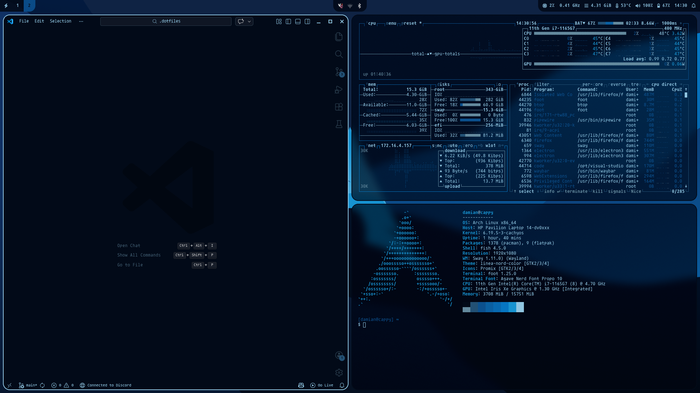

# UNFINISHED

# DamianBossPL's .dotfiles

This repository contains all of the **dotfiles** that I use for my Linux setup.



| Component           | Name                     |
| ------------------- | ------------------------ |
| Window Manager      | SwayFX                   |
| Status Bar          | Waybar                   |
| Notification Daemon | SwayNC                   |
| Menus               | Rofi                     |
| Font                | FiraCode Nerd Font Propo |
| File Manager        | Thunar                   |
| Shell               | Fish                     |

## Install

### Arch Linux - yay

```sh
yay -S ttf-agave-nerd ttf-ms-win11-auto ttf-twemoji-color bluez bluez-obex bluez-utils blueman fish git openssh stow yay cliphist gvfs hyprpicker hyprpolkitagent network-manager-applet pavucontrol power-profiles-daemon python-pywal rofi rofi-emoji swayfx swatnc sway-systemd thunar thunar-volman waybar wl-clip-persist xdg-desktop-portal xdg-desktop-portal-gtk xdg-desktop-portal-hyprland
```

## Packages

### Fonts

- ttf-agave-nerd
- ttf-ms-win11-auto
- ttf-twemoji-color

### Bluetooth

- bluez
- bluez-obex
- bluez-utils
- blueman

### General CLI

- fish
- git
- openssh
- stow
- yay

### General GUI

- cliphist
- gvfs
- hyprpicker
- hyprpolkitagent
- network-manager-applet
- pavucontrol
- power-profiles-daemon
- python-pywal
- rofi
- rofi-emoji
- swayfx
- swatnc
- sway-systemd
- thunar
- thunar-volman
- waybar
- wl-clip-persist
- xdg-desktop-portal
- xdg-desktop-portal-gtk
- xdg-desktop-portal-hyprland
